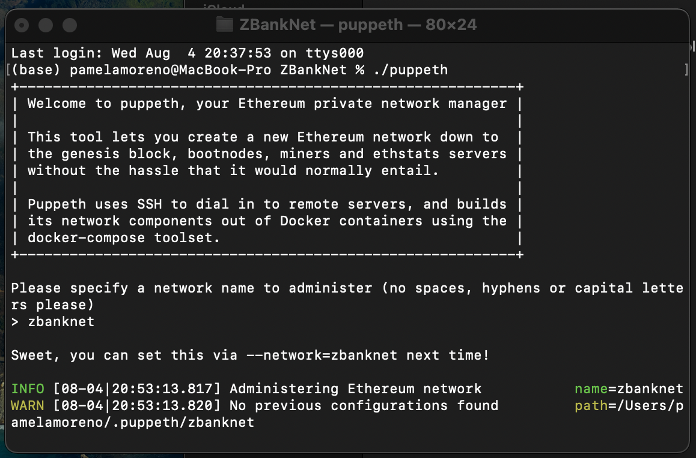
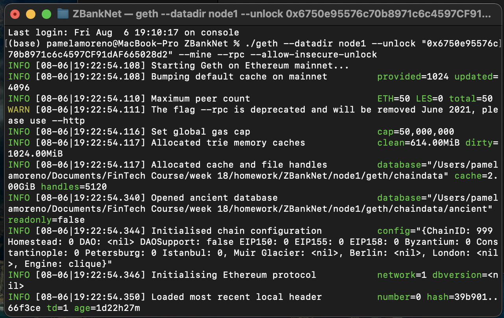
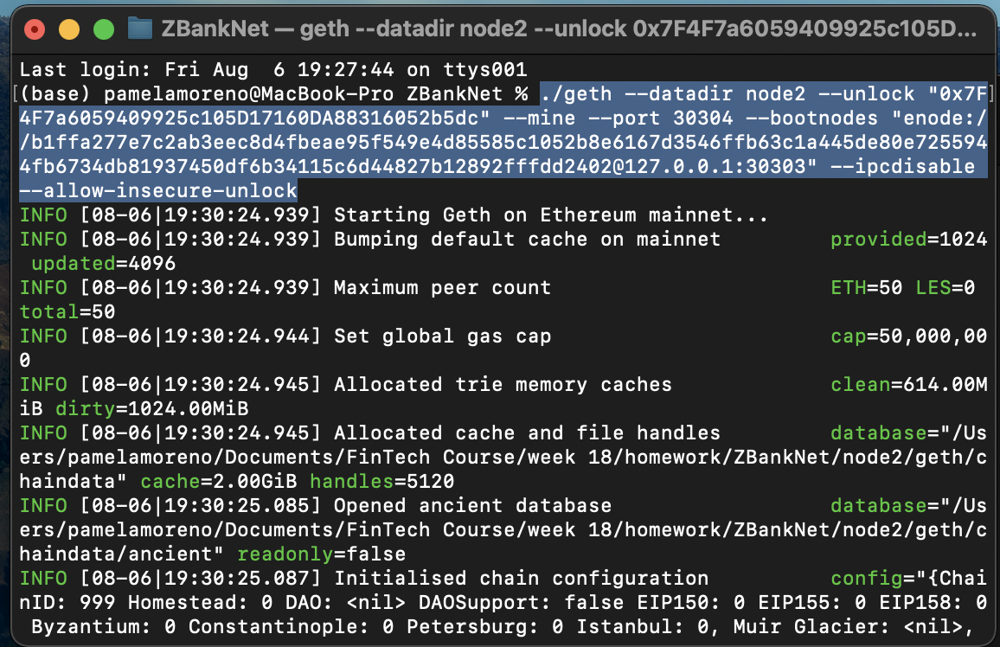

# ZBankNet
Proof of Authority Development Chain

In this project, I have set up a testnet blockchain for a small bank, ZBank.

## 1. Pre Requisites: 

- First, I have downloaded and intalled MyCrypto based on my Operating System: https://download.mycrypto.com/ 

- Then, I have downloaded Go Ethereum Tools https://geth.ethereum.org/downloads/ 

## 2. Instructions on how to use this chain:

### 2.1 Create accounts for two nodes for the network:

- Node 1:

- Node 2:

### 2.2  Create the Genesis Block:
- First, I have located my folder where I have my Blockchain Tools and openend Terminal.
- Then, I have executed the command "./puppeth" to start creating my network

- Following then the instructions as below, I have named my new network "zbanknet"
- I have selected "Clique (Proof of Authority)" consensus algorithm.
- I have copied & pasted both account addresses from the first step into the list of accounts to seal.
- And pasted them again in the list of accounts to be pre-funded.

- Then, I had specified a Chain/Network ID.
- And finally, I have exported new genesis configurations.

- Folder of Network:

### 2.3 Initialize the nodes with the genesis' json file:

- I have used "geth" & "init" to initialize each node with the new zbanknet.json:

### 2.4 Activating the block chain - Mining Nodes:

- In this, section, I have used "geth" & "mine" to run the nodes in separate terminal windows as below to start mininig.

Node 1:

Node 2:

## 3. MyCrypto 

- In this section, I have used MyCrypto GUI wallet to connect to the node with the exposed RPC port.
- Then, I have set a new custom network 

### 3.1 After connecting to the custom network in MyCrypto, it can be tested by sending money between accounts.

-  I have imported the keystore file from the node1/keystore directory into MyCrypto.

Account Node 1 Balance:

- Finally, I have sent a transaction from the node1 account to the node2 account.

